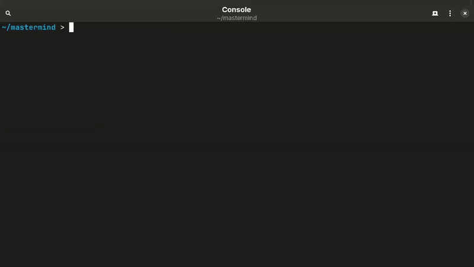

# 🔮 Mastermind - A Second Brain for Spymasters

Mastermind is a CLI tool designed to generate clue words for spymasters in the game of **Codenames**, leveraging large language models (LLMs) of your choice.

Written in Rust, because why not?




## 💻 Usage

To get started, prepare two text files:

1. **Words to Link Together**: Contains the words from your own team.
2. **Words to Avoid**: Contains:
    - Your opponent's words
    - Neutral words
    - The assassin word

Each file should have one word per line. Refer to the [examples](examples) directory for sample files.

Run the tool with:

```bash
mastermind [TO_LINK] [TO_AVOID]
```

Feel free to run the program multiple times to get the best result!

### Options

- `-g`, `--get-models` : Print all available language models
- `-m`, `--set-model` : Select a language model
- `-o`, `--output` : Specify an output file
- `-h`, `--help` : Print help
- `-V`, `--version` : Print version

## 🛠️ Building

### Prerequisites

- `rust`
- `cargo`

Install them using [`rustup`](https://www.rust-lang.org/tools/install), or through your package manager (note: some distributions may package them separately).

### Clone the Repository

```bash
git clone https://github.com/theoforger/mastermind.git
cd mastermind
```

### Configure Environment Variables

Edit the [example.env](example.env) file to add or modify:

- Your API key
- The base URL of an OpenAI-compatible API
- A default language model

Rename the file to `.env`:

```bash
mv example.env .env
```

### Build the Project

Run the following command:

```bash
cargo build --release
```
